# 2. How everything connects

Tessera POS is one system, not a set of separate programs. When a cashier sells a bottle, the stock goes down, the tax invoice goes to KRA, the money shows in the day's takings and the owner's dashboard updates, all at once. You do not copy anything from one screen to another.

This chapter follows one ordinary day at **Karen Wines & Spirits**, a shop with two branches in Nairobi (Karen and Westlands). It shows which part of the system is used at each step, who uses it, and what changes elsewhere as a result. Later chapters explain each part in detail.

## The big picture

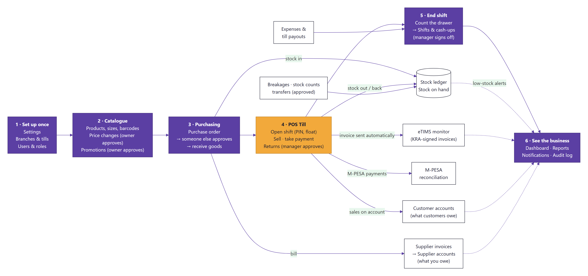

Read the chart from left to right. The purple boxes are the main steps of a day, and the amber box is the till. The white boxes are the records that each step updates for you. The dotted arrows show what feeds the dashboard, the reports and the alerts.

A few words you will meet in this chapter:

| Word | What it means |
| --- | --- |
| **Till** | A computer or tablet at the counter, set up to sell. Each till belongs to one branch. |
| **Shift** | The time one cashier works on one till, from signing in to counting the cash at the end. |
| **Float** | The cash put in the drawer at the start of a shift so the cashier can give change (for example KSh 5,000). |
| **Cash-up** | Counting the cash in the drawer at the end of a shift and comparing it with what the system expected. |
| **Variance** | The difference between the cash counted and the cash expected. Zero is perfect. |
| **eTIMS** | Electronic Tax Invoice Management System: KRA's system that signs every sales invoice. |
| **M-PESA payment request** | A prompt sent to the customer's phone asking them to approve the payment with their M-PESA PIN (also called STK Push). |

## The day, step by step

### Step 1: The owner sets up the business (once)

**Who:** the owner (David Kiprop). **Where:** Administration → Settings, Branches, and Users & roles.

Before the first sale, the owner fills in the business details that print on every receipt and tax invoice, adds the branches and their tills, and creates an account for each member of staff with the right role.

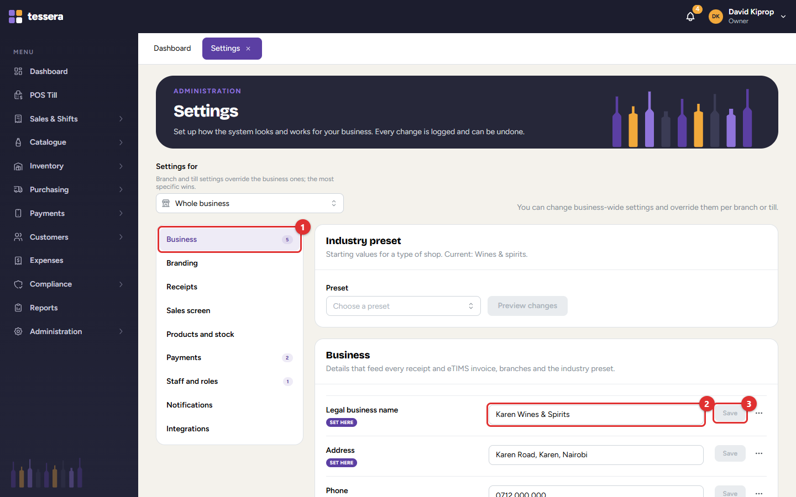

1. Open **Administration → Settings** and choose **Business (1)**.
2. Type the business name **(2)** and click **Save (3)** next to it. Do the same for the address, phone and email.

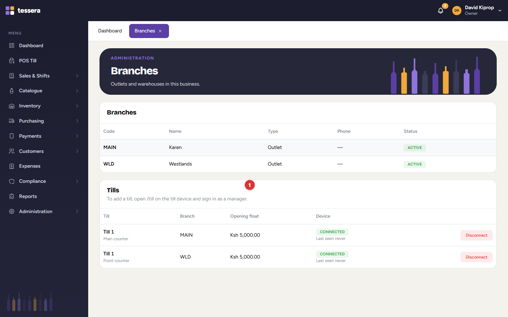

The **Tills (1)** list shows every till and which branch it belongs to. A till is added from the till computer itself (see Step 3).

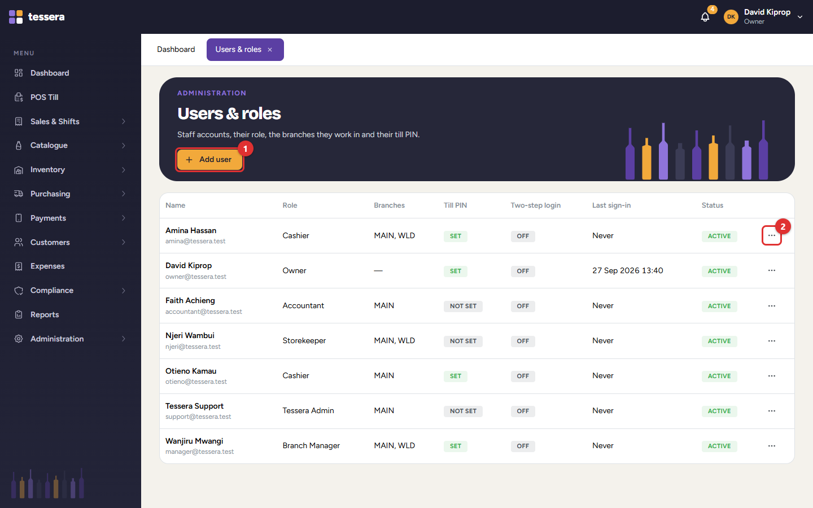

Click **Add user (1)** to create staff accounts. Each person gets a role, such as Cashier or Branch Manager, which decides what they can see and do. Use the **Actions (2)** button to set a cashier's four-digit **till PIN**.

**What changes elsewhere:** the business name and address appear on every receipt and eTIMS invoice. New staff appear on the till's sign-in screen.

> **Important:** The KRA PIN and eTIMS details are set up by Tessera support after they have been checked, because a mistake there stops invoices from being signed.

### Step 2: Products are added and stock is received

**Who:** the owner or admin adds products. The owner, an admin or the accountant orders stock, and a different person approves the order. The storekeeper receives the delivery.
**Where:** Catalogue → Products, Purchasing → Purchase orders, and Inventory → Stock on hand.

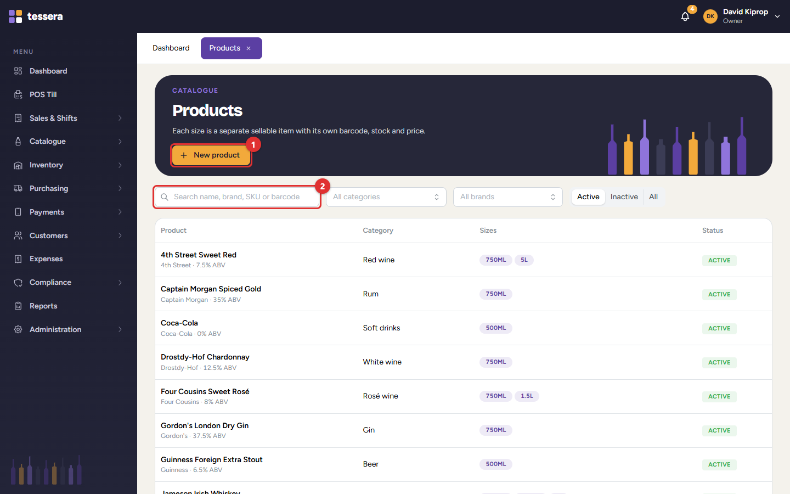

Every item the shop sells is a **product** with one or more sizes (for example Johnnie Walker Black Label 200 ml, 375 ml, 750 ml and 1 L). Click **New product (1)** to add one, or search the list **(2)**.

Stock comes in through a **purchase order**: a list of what you are ordering from a supplier. Someone other than the person who raised it must approve it. When the delivery arrives, the storekeeper records what was received, and the stock goes up.

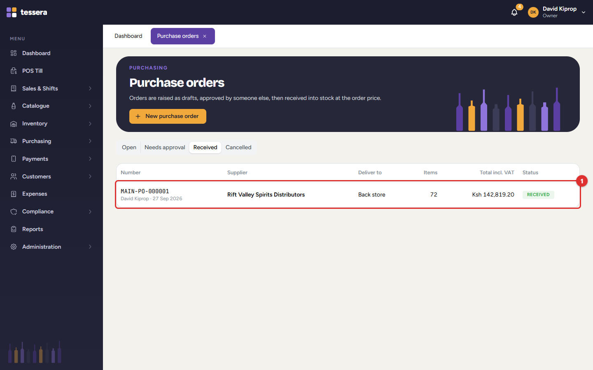

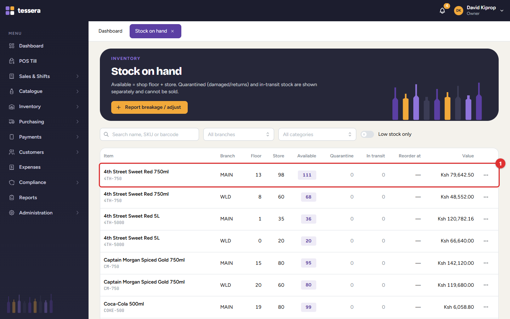

**What changes elsewhere:** receiving goods adds stock to the **stock ledger** (the full history of every bottle in and out) and to Stock on hand. When the supplier's invoice is recorded, the amount appears under **Supplier accounts** as money you owe.

> **Tip:** Prices are set centrally by the owner or admin, and a new price waits for the owner's approval. This keeps both branches charging the same and keeps tax invoices correct.

### Step 3: The cashier signs in and the shift starts

**Who:** the cashier (Amina Hassan, Westlands). **Where:** the till.

A till is set up once: a manager signs in on the till computer, names the till and sets its **opening float**. After that, cashiers sign in with their PIN. Signing in starts the shift with that float.

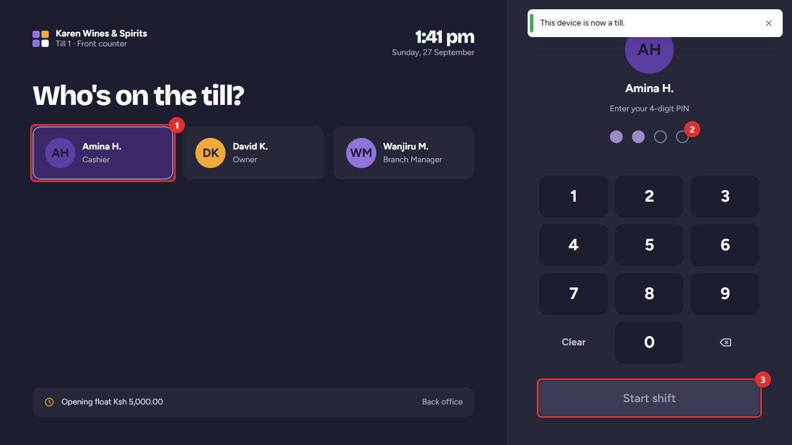

1. Tap your name **(1)**.
2. Enter your four-digit PIN on the keypad. The dots **(2)** fill in as you type.
3. Tap **Start shift (3)**.

**What changes elsewhere:** the shift appears as open on the owner's dashboard (Shifts open now) with its float.

> **Common mistake:** Using another person's PIN. Every sale, refund and cash-up is recorded against the person who signed in, so never share PINs.

### Step 4: The cashier sells, and the customer pays

**Who:** the cashier. **Where:** the till.

A customer buys two bottles of Nederburg Cabernet Sauvignon and a Coca-Cola and pays by M-PESA.

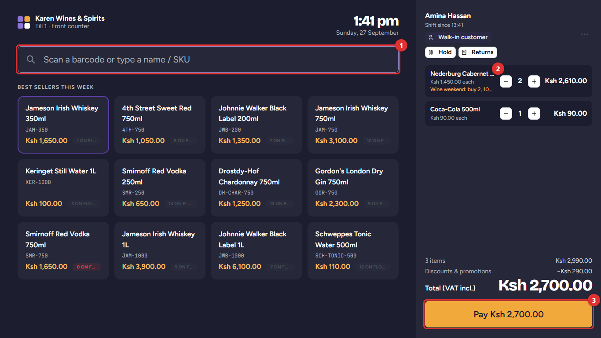

1. Scan the barcode or type part of the name in the search box **(1)**, then tap the item.
2. Check the items in the sale **(2)**. Two bottles of wine qualify for the *Wine weekend: buy 2, 10% off* promotion, so KSh 290 is taken off by itself.
3. Tap **Pay (3)**. The total is KSh 2,700.

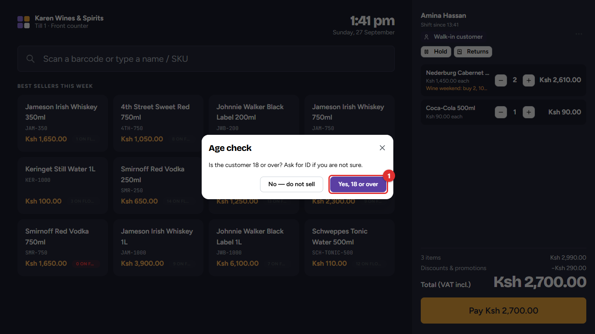

4. Because the sale includes alcohol, the till asks whether the customer is 18 or over. Ask for ID if you are not sure, then tap **Yes, 18 or over (1)**.

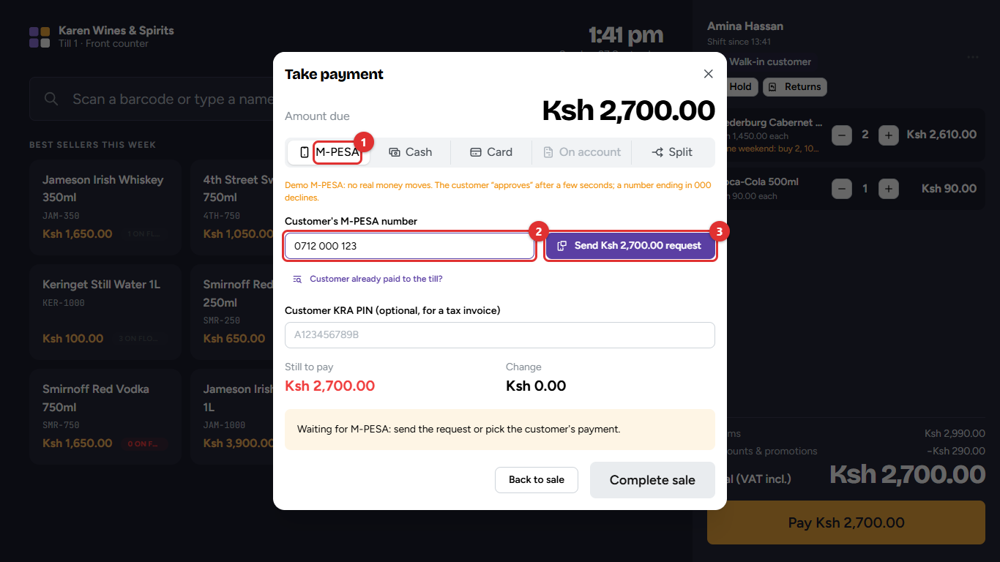

5. **M-PESA (1)** is selected. Type the customer's phone number **(2)** and tap **Send request (3)**. The customer approves the payment on their phone.

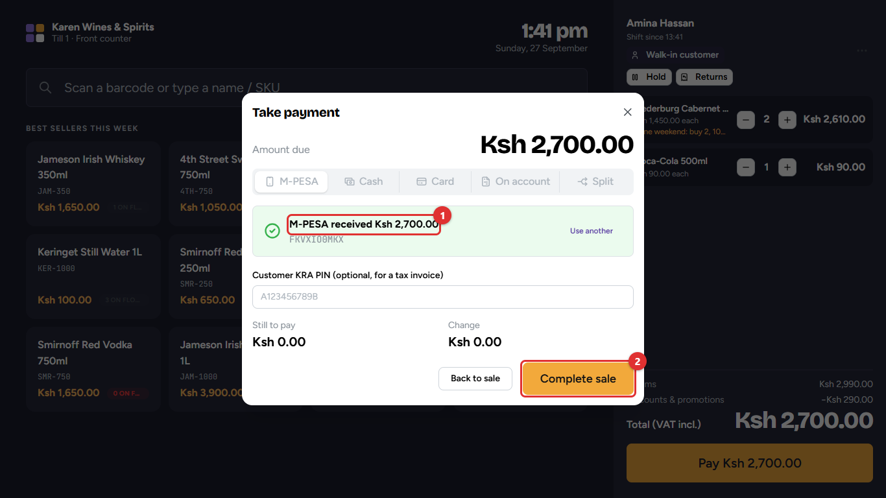

6. When the confirmation **(1)** appears, tap **Complete sale (2)**.

For cash, choose **Cash** and type the amount the customer hands over; the till shows the change to give. Card payments and sales on a customer's account work the same way (see the Sales chapter).

**What changes elsewhere:** the moment the sale completes, the two bottles and the Coca-Cola leave the stock, the M-PESA payment is matched to the sale, and the day's sales on the dashboard go up.

### Step 5: The tax invoice goes to KRA, and the receipt prints

**Who:** nobody has to do anything. **Where:** the receipt, and Compliance → eTIMS monitor.

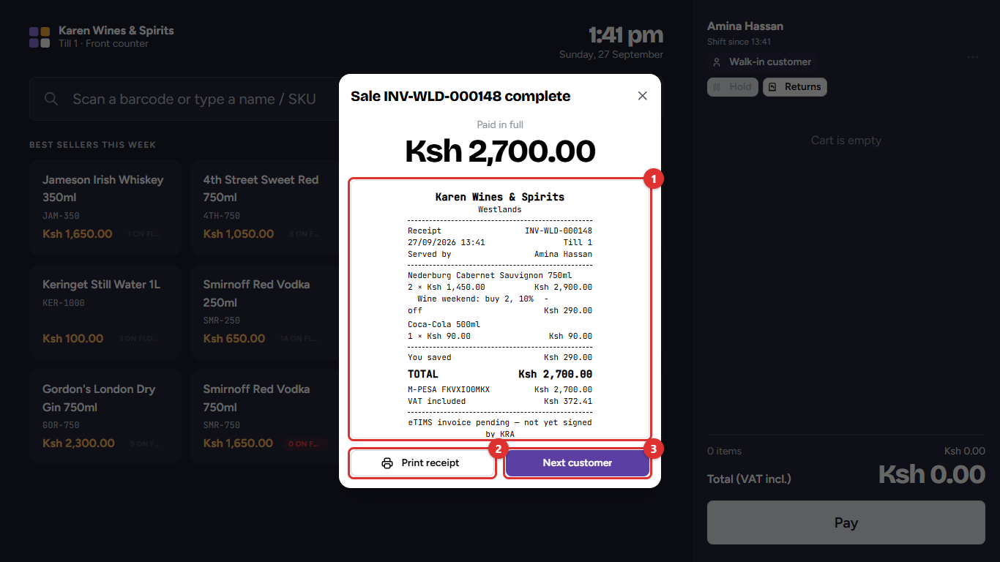

The receipt **(1)** shows the items, the promotion, the M-PESA code and the VAT included. Tap **Print receipt (2)**, then **Next customer (3)**.

Tessera sends every sale to KRA's eTIMS automatically, straight after the sale. The first receipt may say *eTIMS invoice pending*: KRA's signature arrives a few seconds later, and a reprint shows it.

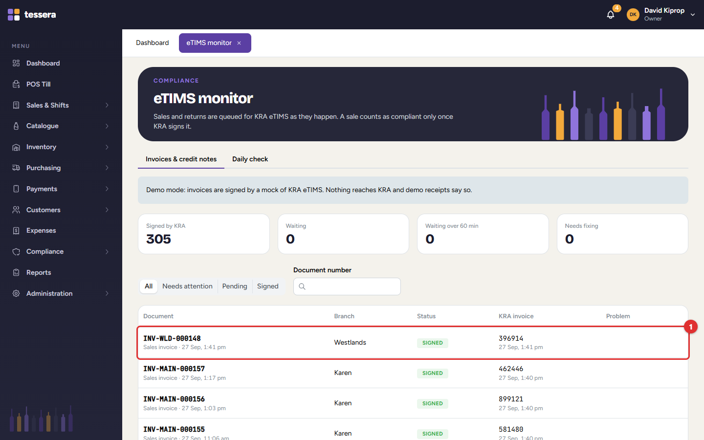

The owner or manager can check that every sale was signed **(1)**. Anything that needs attention is counted in the boxes at the top.

> **Important:** While the system runs on its demonstration connection, invoices are signed by a practice copy of eTIMS and nothing reaches KRA. The screens say so. The live connection is switched on when your business goes live.

### Step 6: Stock goes down, and low stock is flagged

**Who:** nobody has to do anything. **Where:** Inventory → Stock ledger, and the notifications bell.

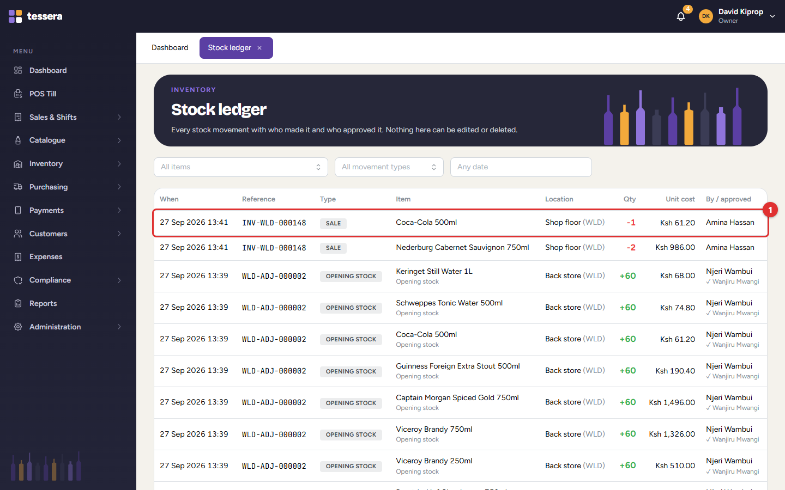

Every movement of stock (sales, deliveries, returns, breakages, transfers) is recorded in the stock ledger **(1)**, with who did it and when. Nobody can edit or delete it.

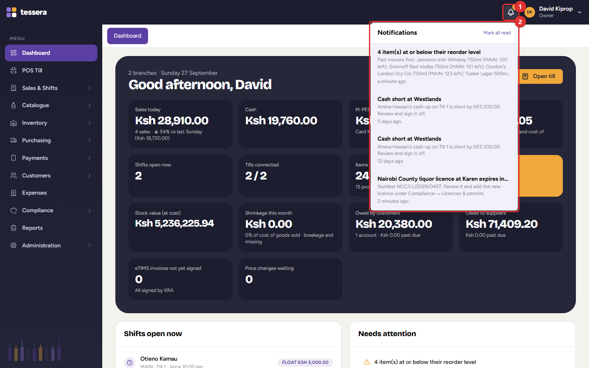

When an item drops to its **reorder level** (the stock level at which you should order more), the owner and managers are told. Click the bell **(1)** to see the alerts **(2)**.

### Step 7: A return needs a manager's approval

**Who:** the cashier starts it, and a manager approves it with their PIN. **Where:** the till → till menu → Return / reprint.

The customer comes back with one sealed bottle: they bought the wrong wine.

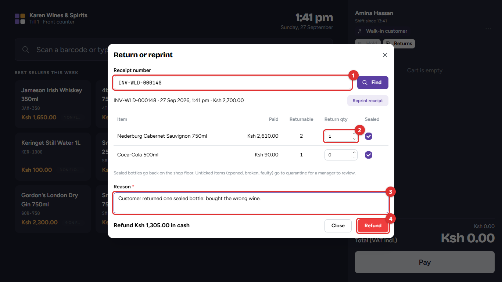

1. Type the receipt number **(1)** and tap **Find**.
2. Enter how many of each item come back **(2)**. A sealed bottle goes back on the shelf; an opened or broken one goes to a separate area for the manager to check.
3. Type the reason **(3)**, then tap **Refund (4)**. Here the refund is KSh 1,305, the bottle's price after the promotion.

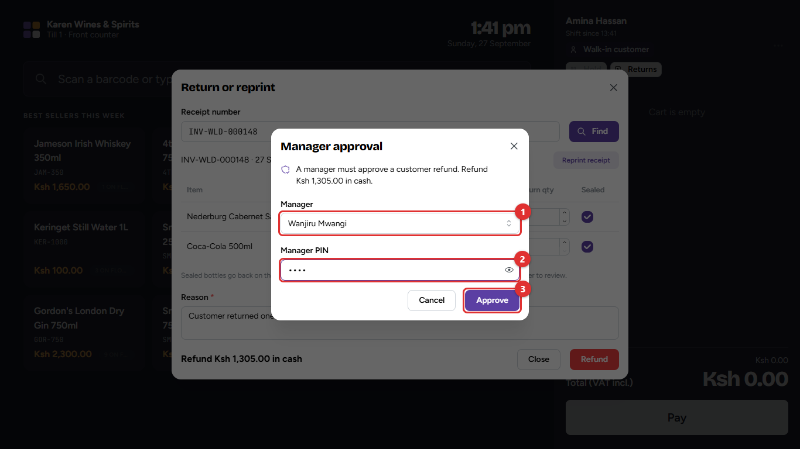

4. The manager chooses their name **(1)**, enters their PIN **(2)** and taps **Approve (3)**.

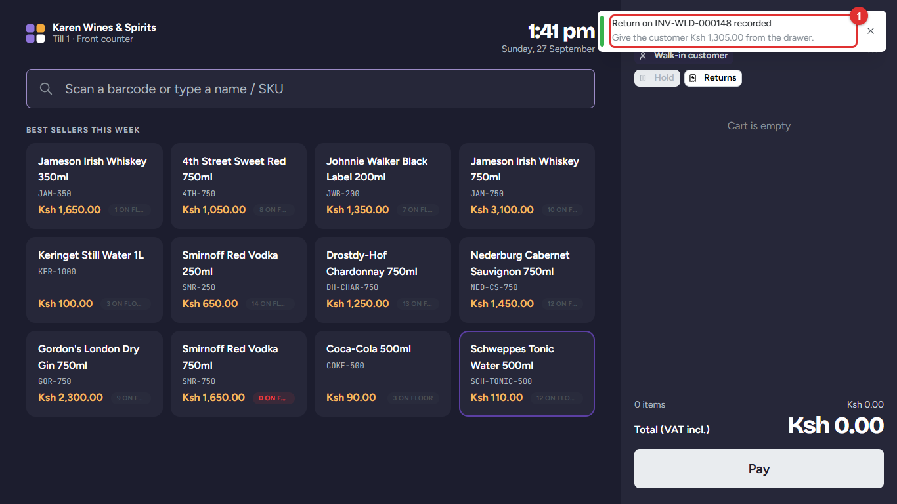

5. The till confirms the return **(1)** and says how much to give back from the drawer.

**What changes elsewhere:** the bottle goes back into stock, a credit note is sent to eTIMS, and the refund is recorded against the shift, so the expected cash in the drawer goes down.

> **Tip:** Refunds are paid in cash from the drawer, even when the customer first paid by M-PESA.

### Step 8: The cashier ends the shift and counts the cash

**Who:** the cashier counts, and a manager signs off. **Where:** till menu → End shift, then Sales & Shifts → Shifts & cash-ups.

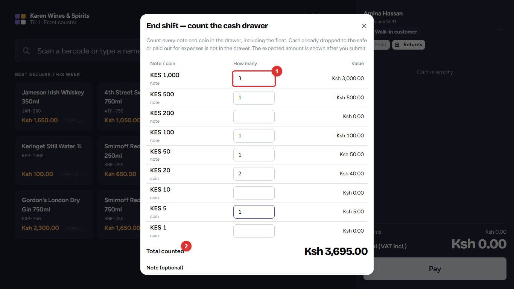

1. Enter how many of each note and coin are in the drawer **(1)**. The total **(2)** adds up as you type.
2. Tap **Submit count (3)**. The cashier does not see the expected amount until after submitting, so the count is honest.

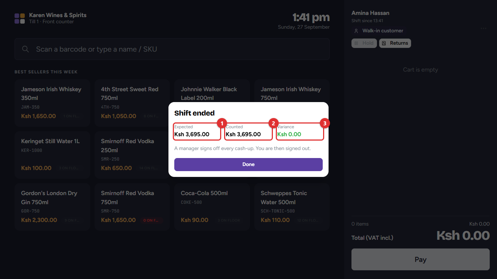

The till shows the cash it expected **(1)**, what was counted **(2)** and the **variance (3)**. Here Amina started with KSh 5,000, refunded KSh 1,305 and took no other cash, so KSh 3,695 was expected, and the drawer balances. If there is a difference, the cashier is asked to explain it.

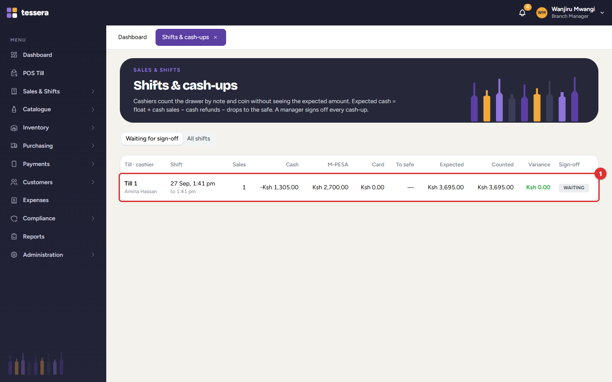

The branch manager checks each cash-up **(1)** and signs it off.

**What changes elsewhere:** the cash-up appears in the *Shift cash-up & variance* report, and any shortage is shown on the dashboard and sent as an alert.

### Step 9: The owner checks the business and reorders

**Who:** the owner. **Where:** Dashboard, Reports, Purchasing.

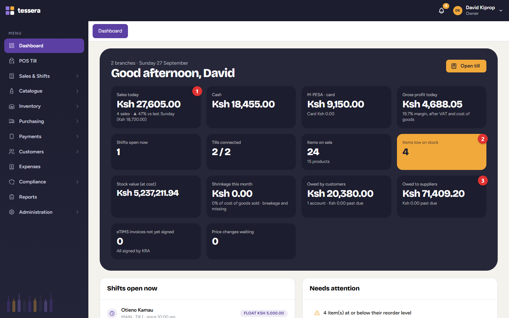

The dashboard shows today's sales **(1)**, how many items are low on stock **(2)** and what is owed to suppliers **(3)**, for both branches together. Open **Reports** for the detail behind each figure.

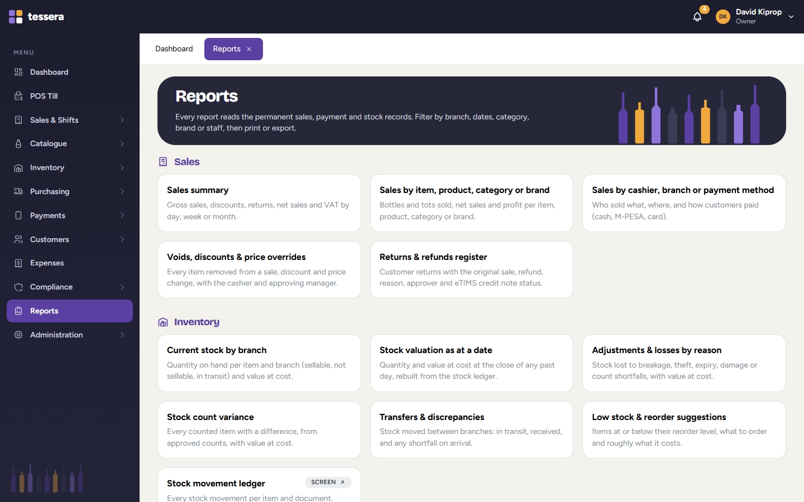

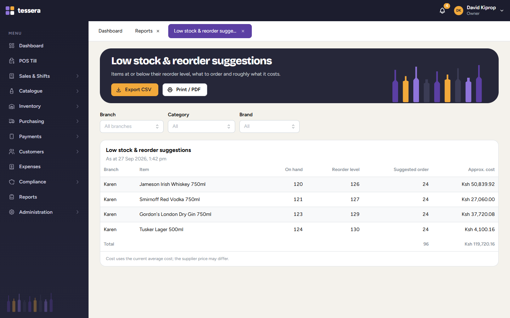

This report lists what to order and roughly what it will cost. To order, open **Purchasing → Purchase orders** and click **New purchase order**:

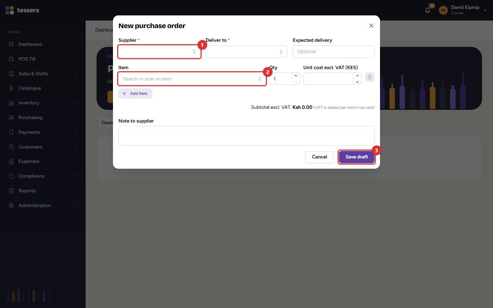

1. Choose the supplier **(1)**.
2. Add each item **(2)** with its quantity and cost.
3. Click **Save draft (3)**. The order then waits for someone else to approve it before it is sent.

### Step 10: Month end: reports for the accountant and VAT

**Who:** the owner or the accountant. **Where:** Reports.

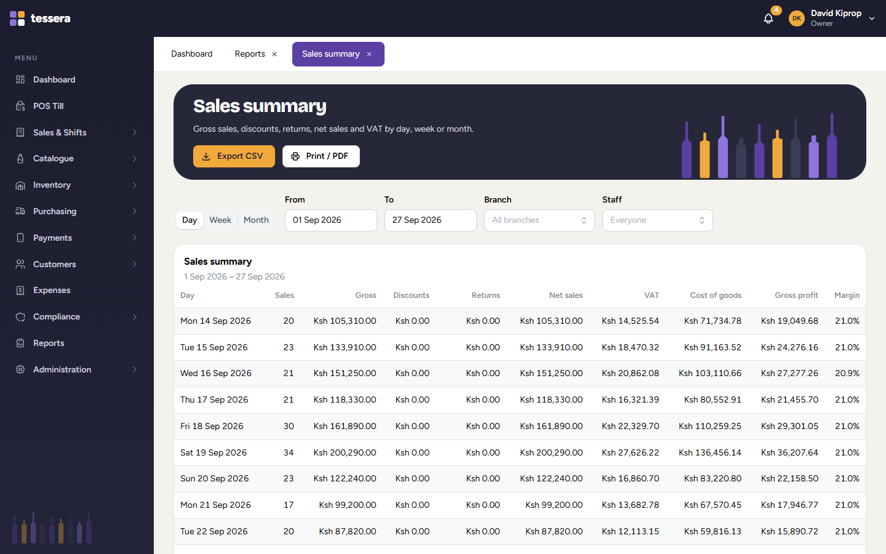

The **Sales summary** shows gross sales, discounts, returns, net sales and **VAT (Value Added Tax)** for any period, by day, week or month. Click **Export CSV** to open it in Excel, or **Print / PDF** to keep a copy. The accountant also uses *Revenue, cost of goods & gross profit*, *Expenses*, *Receivables aging* and *Payables aging*. Because every sale was signed on eTIMS as it happened, the VAT figures match what KRA has on record.

## Who does what: summary

| Step | Part of the system | Who | What else changes |
| --- | --- | --- | --- |
| 1. Set up | Settings, Branches, Users & roles | Owner | Receipts, invoices and the till sign-in screen use these details |
| 2. Products and stock in | Catalogue, Purchasing, Inventory | Owner/admin/accountant order, another person approves, storekeeper receives | Stock goes up; the supplier's bill goes to Supplier accounts |
| 3. Shift starts | Till | Cashier | Shift shows as open on the dashboard |
| 4. Sale and payment | Till | Cashier | Stock goes down; M-PESA matched; sales totals update |
| 5. Tax invoice and receipt | eTIMS (automatic) | Nobody | eTIMS monitor shows the signed invoice |
| 6. Stock and alerts | Stock ledger, notifications | Nobody | Low-stock alerts to owner and managers |
| 7. Return | Till, manager approval | Cashier and manager | Stock back; credit note to eTIMS; expected cash goes down |
| 8. Cash-up | Till, Shifts & cash-ups | Cashier and manager | Cash-up report; alert if short |
| 9. Check and reorder | Dashboard, Reports, Purchasing | Owner | A new purchase order starts step 2 again |
| 10. Month end | Reports | Owner or accountant | Exports for the accountant and VAT filing |

## Frequently asked questions

**Do I need to send invoices to KRA myself?**
No. Every sale and return is sent to eTIMS automatically. Check *Compliance → eTIMS monitor* now and then; it shows anything that still needs attention.

**What happens if the internet goes down during the day?**
The till keeps selling for cash and card and sends the sales when the connection comes back. M-PESA payment requests and returns need the connection. See the Sales chapter.

**Can a cashier see how much money should be in the drawer?**
Not before counting. The expected amount is shown only after the count is submitted, so the count is honest.

**Why can't my branch manager change prices?**
Prices are set centrally by the owner or admin and approved by the owner. This stops unapproved price changes, keeps every branch charging the same, and keeps tax invoices correct. Managers can still approve discounts at the till, up to their limit.
